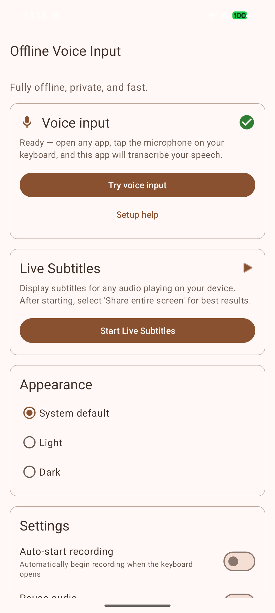
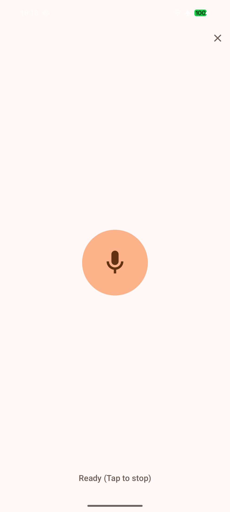

# Offline Voice Input (Android)

An offline, privacy-focused speech-to-text tool for Android, built with Rust. Tap the microphone on the keyboard you already use — your speech is transcribed entirely on-device and typed into any app. Also includes live subtitles and an optional dedicated voice keyboard.

[](https://github.com/notune/android_transcribe_app/releases/latest)
[](https://play.google.com/store/apps/details?id=dev.notune.transcribe)

## Features

- **Voice input in any app:** Tap the microphone on the keyboard you already use (SwiftKey, etc.) or a website's voice search, and your speech is transcribed straight into the text field. The app registers as your device's speech-to-text provider.
- **100% offline & private:** The Parakeet TDT model runs entirely on-device — no audio ever leaves your phone, and no network is required.
- **Live Subtitles:** Real-time captions for any audio/video playing on your device.
- **Optional voice keyboard:** A built-in keyboard you can switch to for voice input wherever you prefer it.
- **Supported Languages:** Bulgarian, Croatian, Czech, Danish, Dutch, English, Estonian, Finnish, French, German, Greek, Hungarian, Italian, Latvian, Lithuanian, Maltese, Polish, Portuguese, Romanian, Slovak, Slovenian, Spanish, Swedish, Russian, Ukrainian.
- **Rust Backend:** Efficient and safe native code using [transcribe-rs](https://github.com/cjpais/transcribe-rs).

## Screenshots

<p float="left">
  
  
  
</p>

## Usage

### Voice input in any app (recommended)

1. Open **Offline Voice Input** once and grant the microphone permission. The home screen shows a **Voice input** status — green when you're ready to go.
2. In any app, tap the **microphone** on your keyboard (e.g. Microsoft SwiftKey) or the voice-search mic on a website. A compact panel slides up over the app you're in, you speak, and your words are inserted as text. Tap to stop — or enable *Auto-stop after silence* in the app's settings to have it stop by itself.

The app plugs into Android's speech-to-text in **three** ways, so it works with a wide range of keyboards and apps:

| Path | Who uses it | What happens |
|---|---|---|
| **Voice-input popup** (`RECOGNIZE_SPEECH`) | SwiftKey, website voice search, many apps | The compact bottom panel opens over the current app |
| **System speech service** (`RecognitionService`) | Keyboards/apps using Android's `SpeechRecognizer` | Recognition runs invisibly in the background with automatic endpointing |
| **Voice keyboard (IME)** | Any keyboard, via the keyboard switcher — also HeliBoard/AnySoftKeyboard-style "switch to voice IME" mic keys | The dedicated voice keyboard opens |

Tap **Try voice input** on the home screen to test the whole flow in one tap.

**Keyboard notes:**

- **SwiftKey:** works out of the box. If SwiftKey's own voice typing opens instead, go to SwiftKey Settings → *Rich input* → turn off **Multi-modal voice typing**.
- **HeliBoard / AnySoftKeyboard / OpenBoard:** their mic key switches to the system *voice input keyboard* — enable the **Offline Voice Input** keyboard (see below) and it will be used automatically.
- **Gboard:** only uses Google's own voice typing, so it can't hand speech to this app. Use one of the keyboards above, or the built-in voice keyboard.
- If Android shows a chooser, pick **Offline Voice Input** and tap **Always**. If another app always opens, clear its default in *Settings → Apps*.

### Dedicated voice keyboard (optional)

Prefer voice input as its own keyboard? Enable the **Offline Voice Input** keyboard via *Open Keyboard Settings* on the home screen, switch to it from your keyboard switcher, then tap **Tap to Record**. By default the recording keeps running even if you switch apps or the keyboard closes (turn off *Record in background* in settings if you don't want that) — the text is inserted when you come back.

### Live subtitles

Tap **Start Live Subtitles** and choose *Share entire screen* to get real-time, on-device captions for any audio or video playing on your device.

## Prerequisites

| Dependency | Installation |
|---|---|
| **JDK 17** | Android Studio (bundled) or `sudo pacman -S jdk17-openjdk` |
| **Android SDK** | Via Android Studio or `sdkmanager` |
| **Android NDK** | `sdkmanager "ndk;28.0.13004108"` |
| **Rust** | [rustup.rs](https://rustup.rs) + `rustup target add aarch64-linux-android` |
| **cargo-ndk** | `cargo install cargo-ndk` |

### Local Configuration

Create a `local.properties` file in the project root (this file is gitignored):

```properties
sdk.dir=/path/to/your/Android/Sdk
```

If your default Java is not JDK 17, uncomment and set `org.gradle.java.home` in `gradle.properties`:

```properties
org.gradle.java.home=/path/to/jdk17
# Examples:
#   /opt/android-studio/jbr          (Android Studio bundled JBR)
#   /usr/lib/jvm/java-17-openjdk     (System JDK 17)
```

## Building

### Debug APK
```bash
./gradlew assembleDebug
# Output: app/build/outputs/apk/debug/app-debug.apk
```

### Release APK
```bash
./gradlew assembleRelease
# Output: app/build/outputs/apk/release/app-release.apk
```

### Release AAB (Google Play)
```bash
./gradlew bundleRelease
# Output: app/build/outputs/bundle/release/app-release.aab
```

### Signing

For release builds, place a `release.keystore` in the project root and set these environment variables:

```bash
export KEY_ALIAS=release
export KEY_PASS=yourpassword
export STORE_PASS=yourpassword
```

### Model Assets

The Parakeet TDT model files (~670 MB) are automatically downloaded from HuggingFace during the first build via a Gradle task. Checksums are verified with SHA-256. No manual download is needed.

## Project Structure

```
├── app/
│   └── src/main/
│       ├── AndroidManifest.xml
│       ├── java/dev/notune/transcribe/   # Android Java code
│       ├── res/                          # Resources (layouts, drawables, etc.)
│       ├── assets/                       # Model files (downloaded at build time)
│       └── jniLibs/                      # Native .so files (built by cargo-ndk)
├── src/                                  # Rust source code (cdylib)
├── transcribe-rs/                        # Rust transcription library (submodule)
├── Cargo.toml                            # Rust workspace
├── build.gradle.kts                      # Root Gradle config
├── app/build.gradle.kts                  # App module config (AGP 8.7.3)
├── settings.gradle.kts
├── gradle.properties
└── fastlane/metadata/android/            # F-Droid metadata
```

## Acknowledgments

- **Speech Model:** [Parakeet TDT 0.6b v3](https://huggingface.co/nvidia/parakeet-tdt-0.6b-v3) by NVIDIA.
    - ONNX quantization by [istupakov](https://huggingface.co/istupakov/parakeet-tdt-0.6b-v3-onnx).
    - Licensed under [CC-BY 4.0](https://creativecommons.org/licenses/by/4.0/).
- **Inference Backend:** [transcribe-rs](https://github.com/cjpais/transcribe-rs) by CJ Pais.

## License

[MIT](LICENSE)
